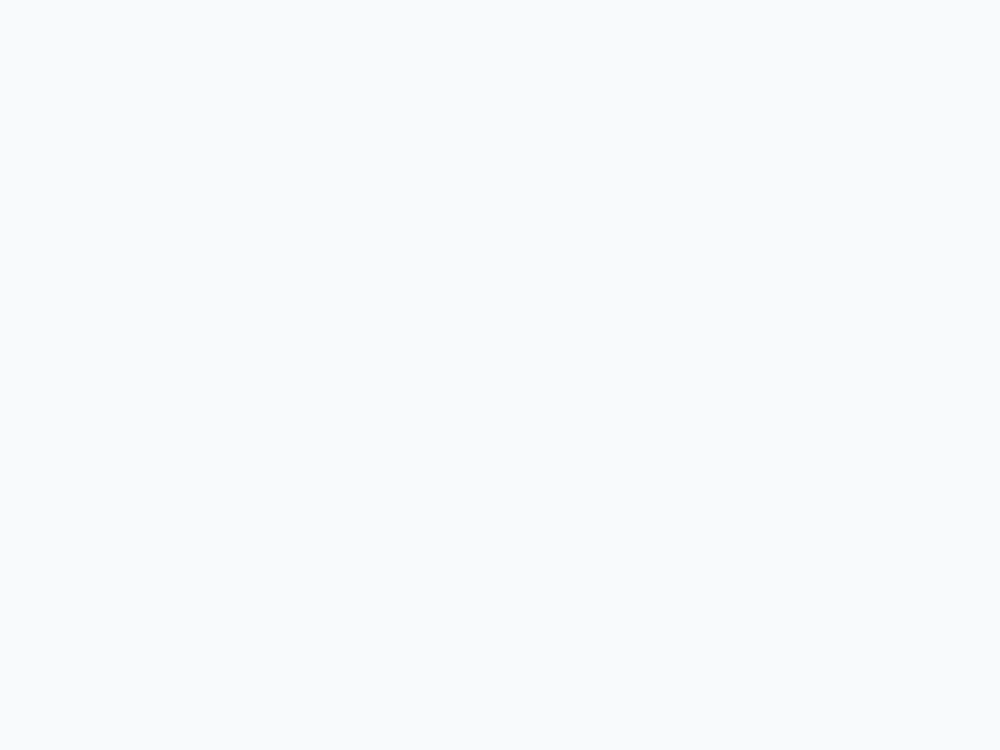

# 📇 ProCard AI - Professional Business Card Builder

ProCard AI는 Gemini AI를 활용하여 누구나 손쉽게 전문적인 명함을 디자인하고 생성할 수 있는 도구입니다. 200개 이상의 다양한 테마와 AI 기반 콘텐츠 최적화 기능을 제공합니다.


### 🎨 200+ 다양한 테마 갤러리


## ✨ 주요 기능

- **🤖 AI 기반 디자인 및 콘텐츠**: Gemini AI를 통해 명함의 커리어 목표를 최적화하고, 사용자 데이터에 맞는 최적의 디자인 테마를 추천받을 수 있습니다.
- **🎨 200+ 프리미엄 테마**: 모던, 미니멀, 사이버펑크, 빈티지 등 수백 가지의 독특한 테마를 즉시 적용할 수 있습니다.
- **🛠️ 실시간 커스터마이징**: 색상, 스케일, QR 코드 위치 등을 실시간으로 조정하며 드래그 앤 드롭으로 요소를 배치할 수 있습니다.
- **🖨️ 고화질 저장 및 인쇄**: 완성된 디자인을 이미지로 저장하거나 앞/뒷면을 모두 구성하여 인쇄할 수 있습니다.
- **💾 프로필 관리**: 여러 개의 프로필을 저장하고 불러와 상황에 맞는 명함을 빠르게 생성합니다.

## 🛠️ 기술 스택

- **Frontend**: React 19, TypeScript, Tailwind CSS, Vite
- **AI**: Google Gemini API (@google/genai)
- **Icons**: Lucide React
- **Automation**: Husky (Git Hooks), Node.js Scripts

## 🚀 시작하기

### 설치
```bash
npm install
```

### 실행
```bash
npm run dev
```

### 테마 동기화
새로운 테마를 추가한 후 다음 명령어를 통해 레지스트리를 갱신합니다.
```bash
npm run sync-themes
```

## 🎨 테마 추가 가이드 (개발자용)

ProCard AI는 고도로 자동화된 테마 등록 시스템을 갖추고 있습니다.

1. `components/themes/` 폴더에 새 `.tsx` 파일을 생성합니다.
2. 파일 상단에 한글 이름을 라벨 주석으로 추가합니다.
   ```tsx
   // @label: 내 멋진 테마
   export const MyAwesomeTheme = ({ ... }) => { ... }
   ```
3. `git commit`을 하면 **Husky Pre-commit Hook**에 의해 `themes.generated.ts`가 자동으로 업데이트되어 시스템에 즉시 등록됩니다.

자세한 내용은 [HOW_TO_ADD_NEW_THEME.md](./HOW_TO_ADD_NEW_THEME.md)를 참조하세요.

## 📁 프로젝트 구조

- `components/`: 주요 UI 컴포넌트
  - `themes/`: 개별 테마 파일들 및 자동 생성된 레지스트리
- `services/`: Gemini API 연동 서비스
- `scripts/`: 자동화 스크립트 (테마 동기화 등)
- `types.ts`: 전역 타입 정의

## 📄 라이선스

이 프로젝트는 개인 및 상업적 용도로 자유롭게 사용 가능합니다.
